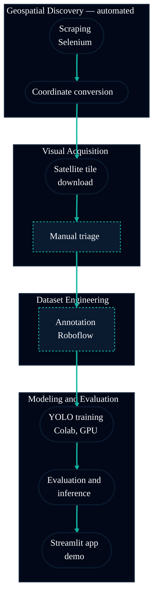

# Execution Guide — Helipad Detector

Step-by-step guide to run the full pipeline, from a fresh clone to the working app, including
the extra geolocation automation for finding helipads within a given perimeter.

> Repository: `https://github.com/Mindful-AI-Assistants/3-project-ai-ml-yolo-helipoint-detector-New`

---

## 0. Pipeline overview



*Dashed-border nodes mark the manual/human steps (visual triage, Roboflow annotation) — every
other node runs automatically.*

This guide follows that exact order. Steps 1 and 2 are the **extra automation resource** the
group built beyond the briefing's minimum requirements, so they get a more detailed section.

---

## 1. Prerequisites

```bash
git clone https://github.com/Mindful-AI-Assistants/3-project-ai-ml-yolo-helipoint-detector-New.git
cd 3-project-ai-ml-yolo-helipoint-detector-New

python3 -m venv .venv
source .venv/bin/activate
pip install -r requirements.txt
```

For the scraping step (section 2) you also need:
- **Firefox** installed
- **geckodriver** (Selenium's driver for Firefox) — install via `brew install geckodriver` on macOS, or download from https://github.com/mozilla/geckodriver/releases

---

## 2. Extra automation — locating helipads via Selenium

### 2.1 The problem this automation solves

Before any satellite image can be downloaded, we first need to know **where** helipads are —
the latitude and longitude of each one. Without automation, this means manually opening the
reference aviation website (FlightMarket), browsing airport by airport, and copying each
helipad's coordinate by hand. Covering several regions of Brazil this way is slow and prone to
transcription errors — the kind of repetitive work that does not scale.

The `src/geospatial/helipad_scraper.py` script replaces that manual search with a bot that:

1. opens each state's listing page (`/pt/aeroportos/<UF>`) and collects the ICAO codes of every airfield listed, automatically navigating/paginating through results;
2. visits each airfield's page and checks its title/text to confirm it is actually a **helipad** (not a regular airport);
3. extracts the coordinate in DMS (degrees/minutes/seconds) format from the page text, using a regular expression tolerant to formatting variations;
4. performs **reverse geocoding** via Nominatim/OpenStreetMap to resolve the neighborhood/area name for that coordinate (falling back to the site's own city name, and finally to the ICAO code, if geocoding fails);
5. writes each helipad found incrementally to a CSV — so even if the process is interrupted midway, progress is not lost.

### 2.2 How to run it

```bash
python src/geospatial/run_scraping_pipeline.py
```

This single command runs the scraper below **and then** the coordinate conversion (section 3)
automatically in sequence — you don't need to run them as two separate steps. To run only the
scraper on its own (e.g. to customize the search), you can still call it directly:

```bash
python src/geospatial/helipad_scraper.py
```

The script first interactively asks how many helipads you want to collect (1 to 500). It also
accepts optional command-line arguments:

```bash
python src/geospatial/helipad_scraper.py \
  --estados RJ MG RS \
  --output src/geospatial/helipad_coordinates_raw.csv \
  --delay 1.5 \
  --geocode
```

| Parameter | Effect |
|---|---|
| `--estados` | List of state abbreviations to scan (SP is always skipped — the project's core study area is already covered separately) |
| `--output` | Output CSV path |
| `--no-headless` | Shows Firefox on screen instead of running invisibly (useful for debugging) |
| `--delay` | Pause, in seconds, between requests, to avoid overloading the site |
| `--geocode` | Enables real neighborhood lookup via Nominatim (more accurate, but slower: ~1 request/second) |

### 2.3 Output

A CSV with 3 columns:

| Column | Content |
|---|---|
| `Carimbo de data/hora` | When that helipad was collected |
| `Coordenadas da Bounding Box` | Coordinate in DMS format, e.g. `23°33'12"S 46°38'01"W` |
| `Nome do Bairro` | Neighborhood/area identified via geocoding |

### 2.4 Real gains from this automation

- **Scale**: manually covering 15 states, airport by airport, would take days; the script runs this in the background.
- **Consistency**: eliminates coordinate transcription errors, the most common problem in manual geographic data collection.
- **Traceability**: each helipad comes out with a collection timestamp and an already-resolved neighborhood name, ready for the next step.

---

## 3. Converting coordinates into a geographic bounding box

`helipad_scraper.py` produces a **point** (lat/lon). But downloading satellite tiles requires
an **area** around that point. That conversion is what `transform_coordinates.py` does.

If you used `run_scraping_pipeline.py` in section 2, this step already ran automatically.
To run it on its own instead:

```bash
python src/geospatial/transform_coordinates.py
```

What it does, step by step:

1. reads the raw CSV (`helipad_coordinates_raw.csv`);
2. converts each coordinate from DMS to decimal degrees;
3. applies a `±0.0005°` margin (≈ 55 meters) around the point, producing a `(lon_min, lat_min, lon_max, lat_max)` rectangle;
4. writes the result to `src/geospatial/helipad_coordinates_bbox.csv` — this is the file the next step (tile download) actually consumes.

---

## 4. Downloading satellite tiles

Notebook: `src/geospatial/geospatial_image_collection.ipynb`

1. Open the notebook (locally or in Colab — this step doesn't need a GPU, it's just HTTP downloads).
2. It reads `helipad_coordinates_bbox.csv`.
3. For each bounding box, it converts to XYZ tile indices (`z=19`, the recommended zoom for small targets like helipads) via the `deg2tile` function.
4. It downloads each tile from **ESRI World Imagery** (a public source that requires attribution — see the README's "Image Attribution" section).
5. It assembles mosaics per neighborhood/region, ready for visual triage.

---

## 5. Manual triage + Roboflow upload

This step is manual by design — a person reviews the generated mosaics and discards tiles
without a visible helipad, keeping only relevant images.

1. Open the mosaics generated under `data/tiles/`.
2. Select tiles with a clearly visible helipad.
3. Upload those images to the group's Roboflow project.
4. In Roboflow: draw bounding boxes (single class `helipad`), configure a `640×640` resize, augmentations (rotation, flip, brightness/contrast), and the `70/20/10` train/valid/test split.
5. Export in **YOLOv8** format.
6. Download the exported package into `data/training/yolo_dataset/` (it already comes with the expected `train/`, `valid/`, `test/`, `data.yaml` structure).

---

## 6. Training the YOLO model

> [!WARNING]
> Run this step on **Google Colab** (free T4 GPU), not locally — training is GPU-bound, and the
> team's development machines (Apple Silicon, no CUDA) make this impractical on CPU. The full
> reasoning is in `README.md`, under "Why Google Colab instead of a local machine".

### Experiment 1 (already completed)

Notebook: `src/training/yolo_training.ipynb` — 60 epochs, `yolov8n`, seed 42.
Result saved at `artifacts/runs/detect/exp1/`.

### Experiment 2 (ready to run)

Notebook: `src/training/yolo_training_exp2.ipynb` — identical to exp1, except **epochs: 60 → 100**,
testing whether training longer improves, maintains, or hurts the metrics (overfitting risk on a
small dataset). The notebook's last cell already includes an automatic comparison between `exp1`
and `exp2` once both `results.csv` files exist locally.

After running it in Colab, download the generated zip and unzip it into:
```
artifacts/runs/detect/exp2/
```

---

## 7. Evaluation and inference

Notebook: `notebooks/model_analysis.ipynb`

- loads the trained model(s);
- generates loss, precision/recall, and mAP curves;
- builds the confusion matrix;
- runs inference on `data/inference/unseen_neighborhood/` — the neighborhood held **out** of training, to genuinely test generalization.

---

## 8. Demo app (Streamlit)

```bash
streamlit run apps/streamlit_app/app.py
```

The app:
- automatically discovers every experiment with a ready `best.pt` under `artifacts/runs/detect/` and lists it in the sidebar selector (so `exp2`, once trained, shows up on its own, no code changes needed);
- supports image upload or a region search via a lat/lon bounding box, downloading and analyzing ESRI tiles on the fly;
- displays detections with an adjustable confidence threshold.

---

## Summary — automated vs. manual

| Step | Automated | Manual |
|---|:---:|:---:|
| Locate helipads (coordinates) | ✅ Selenium | |
| Convert coordinate into bounding box | ✅ script | |
| Download satellite tiles | ✅ notebook | |
| Visual quality triage | | ✅ human |
| Bounding box annotation | | ✅ human (Roboflow) |
| Model training | ✅ notebook (Colab) | |
| Quantitative evaluation | ✅ notebook | |
| Qualitative error analysis | | ✅ human |

The Selenium automation (section 2) and the coordinate conversion (section 3) are exactly the
group's **extra resource** beyond the briefing's minimum: they remove the step that used to be
done by hand, airport by airport, and turn it into a repeatable, traceable process.
